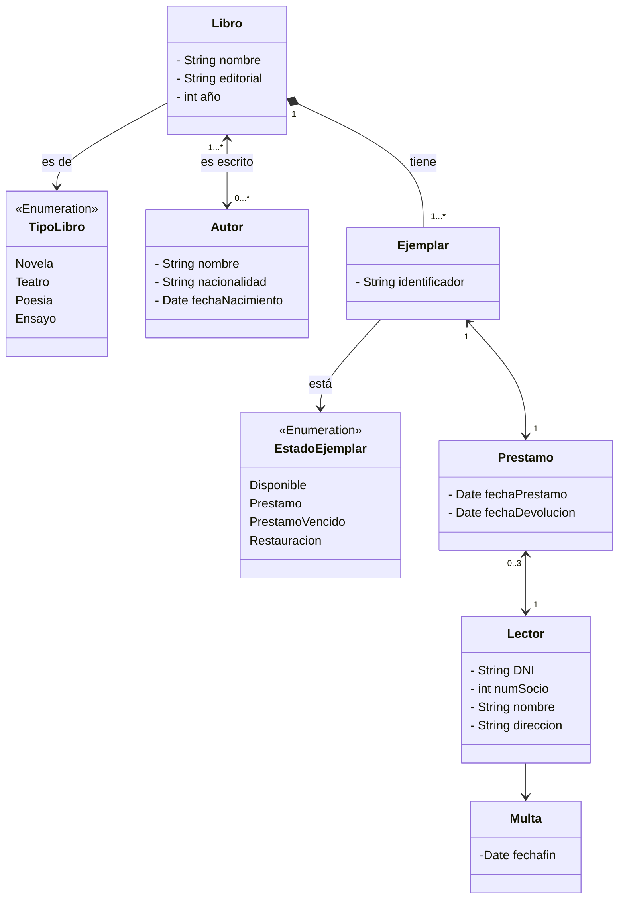

```mermaid
classDiagram
    class Libro {
        - String nombre
        - String editorial
        - int año
    }
    class TipoLibro{
        <<Enumeration>>
         Novela
         Teatro
         Poesia
         Ensayo
    }
    class Autor {
        - String nombre
        - String nacionalidad
        - Date fechaNacimiento
    }
    class Ejemplar {
        - String identificador
    }
    class EstadoEjemplar{
        <<Enumeration>>
        Disponible
        Prestamo
        PrestamoVencido
        Restauracion
    }
    class Lector {
        - String DNI
        - int numSocio
        - String nombre
        - String direccion
    }
    class Prestamo {
        - Date fechaPrestamo
        - Date fechaDevolucion
    }
    class Multa{
        -Date fechafin
    }

    Libro "1" *-- "1...*" Ejemplar : tiene
    Libro --> TipoLibro : es de
    Ejemplar --> EstadoEjemplar: está
    Ejemplar "1" <--> "1" Prestamo
    Prestamo "0..3" <--> "1" Lector
    Libro "1...*" <--> "0...*" Autor: es escrito
    Lector --> Multa
```
