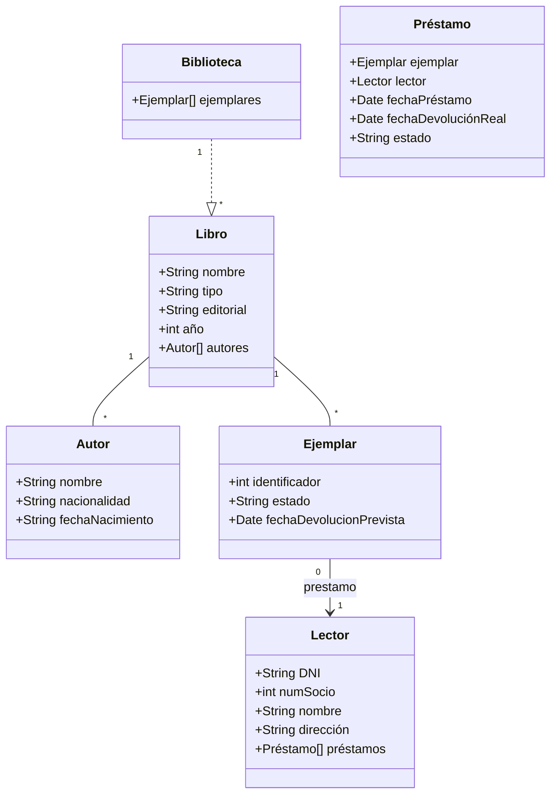

```mermaid

classDiagram

    class Libro{
      +String nombre
      +String tipo
      +String editorial
      +int año
      +Autor[] autores
    }
    class Biblioteca{
        +Ejemplar[] ejemplares
    }
    class Autor{
      +String nombre
      +String nacionalidad
      +String fechaNacimiento
    }
    class Ejemplar{
        +int identificador
        +String estado
        +Date fechaDevolucionPrevista
    }
    class Lector{
        +String DNI
        +int numSocio
        +String nombre
        +String dirección 
        +Préstamo[] préstamos
    }
    class Préstamo{
        +Ejemplar ejemplar
        +Lector lector
        +Date fechaPréstamo
        +Date fechaDevoluciónReal
        +String estado
    }
    Libro "1" -- "*" Ejemplar
    Libro "1" -- "*" Autor
    Ejemplar "0" --> "1" Lector : prestamo
    Biblioteca "1"..|> "*" Libro
```