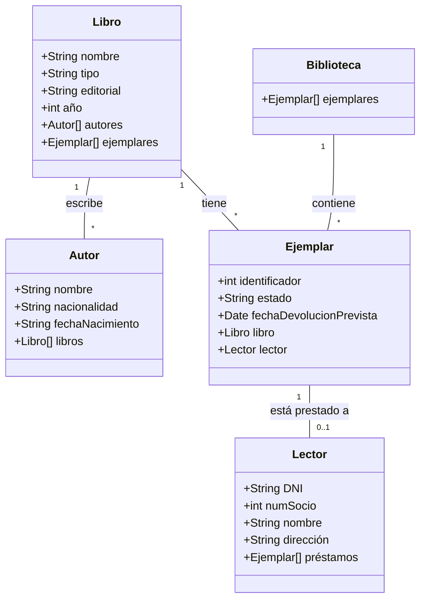

```mermaid
   classDiagram
    class Libro{
      +String nombre
      +String tipo
      +String editorial
      +int año
      +Autor[] autores
      +Ejemplar[] ejemplares
    }
    class Biblioteca{
        +Ejemplar[] ejemplares
    }
    class Autor{
      +String nombre
      +String nacionalidad
      +String fechaNacimiento
      +Libro[] libros
    }
    class Ejemplar{
        +int identificador
        +String estado
        +Date fechaDevolucionPrevista
        +Libro libro
        +Lector lector
    }
    class Lector{
        +String DNI
        +int numSocio
        +String nombre
        +String dirección 
        +Ejemplar[] préstamos
    }

    Libro "1" -- "*" Autor : escribe
    Libro "1" -- "*" Ejemplar : tiene
    Biblioteca "1" -- "*" Ejemplar : contiene
    Ejemplar "1" -- "0..1" Lector : está prestado a
```
