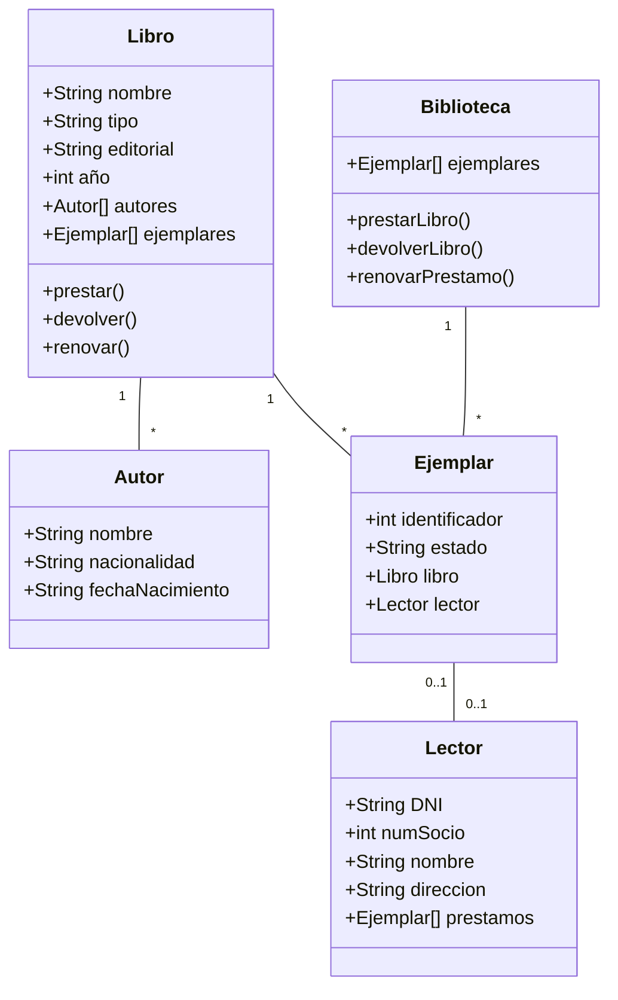

```mermaid
classDiagram
    class Libro {
        +String nombre
        +String tipo
        +String editorial
        +int año
        +Autor[] autores
        +Ejemplar[] ejemplares
        +prestar()
        +devolver()
        +renovar()
    }

    class Biblioteca {
        +Ejemplar[] ejemplares
        +prestarLibro()
        +devolverLibro()
        +renovarPrestamo()
    }

    class Autor {
        +String nombre
        +String nacionalidad
        +String fechaNacimiento
    }

    class Ejemplar {
        +int identificador
        +String estado
        +Libro libro
        +Lector lector
    }

    class Lector {
        +String DNI
        +int numSocio
        +String nombre
        +String direccion
        +Ejemplar[] prestamos
    }

    Libro "1" -- "*" Autor
    Libro "1" -- "*" Ejemplar
    Biblioteca "1" -- "*" Ejemplar
    Ejemplar "0..1" -- "0..1" Lector

```
