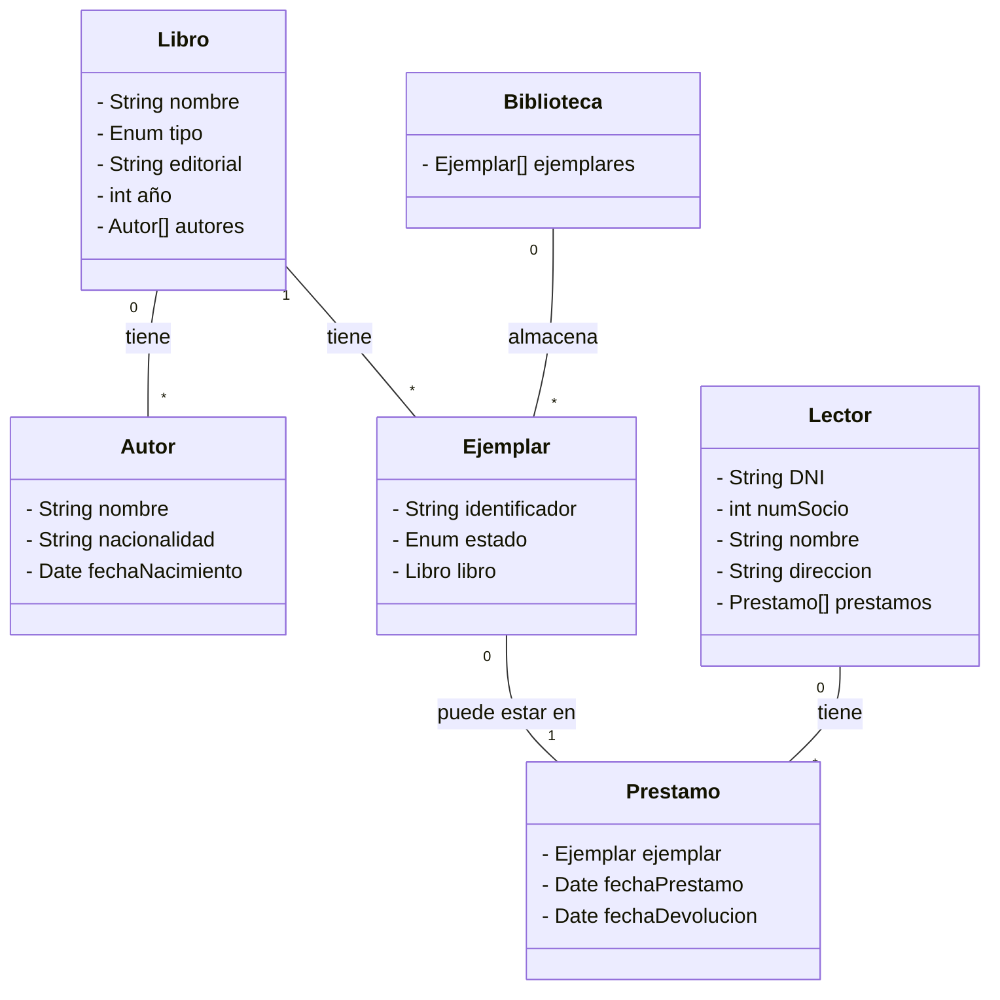

```mermaid
classDiagram
    class Libro {
        - String nombre
        - Enum tipo
        - String editorial
        - int año
        - Autor[] autores
    }
    class Autor {
        - String nombre
        - String nacionalidad
        - Date fechaNacimiento
    }
    class Ejemplar {
        - String identificador
        - Enum estado
        - Libro libro
    }
    class Biblioteca {
        - Ejemplar[] ejemplares
    }
    class Lector {
        - String DNI
        - int numSocio
        - String nombre
        - String direccion
        - Prestamo[] prestamos
    }
    class Prestamo {
        - Ejemplar ejemplar
        - Date fechaPrestamo
        - Date fechaDevolucion
    }

    Libro "1" -- "*" Ejemplar : tiene
    Libro "0" -- "*" Autor : tiene
    Biblioteca "0" -- "*" Ejemplar : almacena
    Ejemplar "0" -- "1" Prestamo : puede estar en
    Lector "0" -- "*" Prestamo : tiene
```
