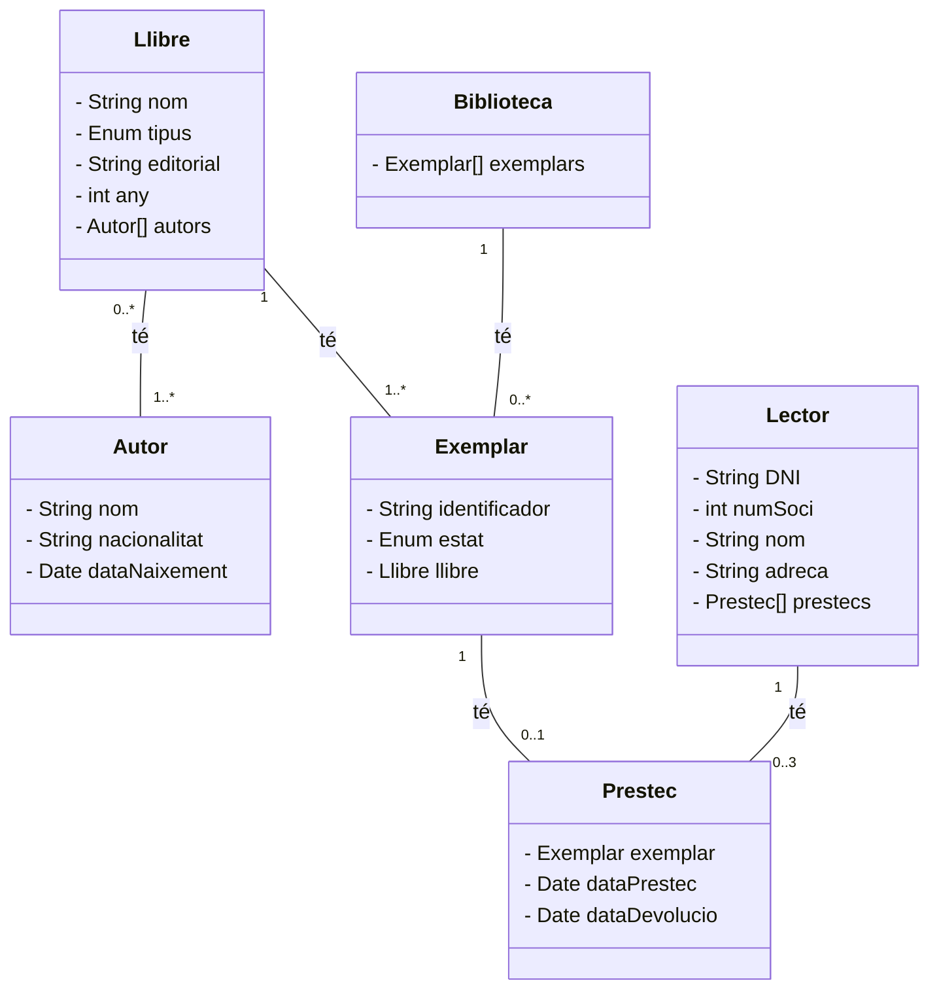

```mermaid
classDiagram
    class Llibre {
        - String nom
        - Enum tipus
        - String editorial
        - int any
        - Autor[] autors
    }
    class Autor {
        - String nom
        - String nacionalitat
        - Date dataNaixement
    }
    class Exemplar {
        - String identificador
        - Enum estat
        - Llibre llibre
    }
    class Biblioteca {
        - Exemplar[] exemplars
    }
    class Lector {
        - String DNI
        - int numSoci
        - String nom
        - String adreca
        - Prestec[] prestecs
    }
    class Prestec {
        - Exemplar exemplar
        - Date dataPrestec
        - Date dataDevolucio
    }

    Llibre "1" -- "1..*" Exemplar : té
    Llibre "0..*" -- "1..*" Autor : té
    Biblioteca "1" -- "0..*" Exemplar : té
    Exemplar "1" -- "0..1" Prestec : té
    Lector "1" -- "0..3" Prestec : té

```
